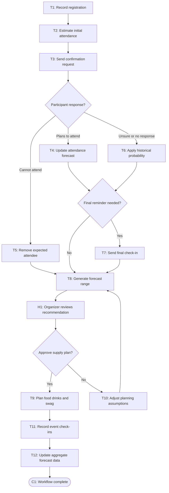

# Workflow of Tasks

*Replace all bracketed prompts with information specific to your proposed system. Delete instructional text that does not belong in your final specification. Add or remove task sections as needed. Every task shown in the general workflow must have a corresponding task specification below.*

## 1. Workflow Overview
### 1.1 Workflow Goal
This workflow supports the system goal defined in `my_first_agent/README.md`.

### 1.2 Workflow Trigger

A participant registers prior to the CPVC event.

### 1.3 Completion Condition at Runtime

The participant’s attendance status is recorded at event check-in, and the forecast is compared with actual attendance for future improvement.

### 1.4 General Workflow

When a participant registers, HackTrack stores only the registration information necessary for attendance planning, such as registration date, event type, and an optional attendance-confidence response. It does not collect unrelated personal data or infer sensitive characteristics. The system begins with CPVC’s historical attendance rate and adjusts the event forecast as participants voluntarily confirm, decline, or indicate that they are unsure.

HackTrack sends at most two concise reminders: one confirmation request several days before the event and, if necessary, one final check-in shortly before the event. Participants can opt out of reminders. The system combines aggregate responses with historical attendance patterns and presents organizers with a forecast range, recommended purchasing count, and uncertainty level. An organizer reviews the recommendation before purchasing supplies. At the event, actual check-ins are recorded in aggregate and used to improve future forecasts.

### 1.5 Workflow Diagram

[Insert a flowchart showing the tasks in sequence. Label each task with a task number and short name. Show decision branches, loops, review points, and possible stopping conditions. Below is an example of a Mermaid. You can either edit the mermaid below yourself or ask ChatGPT to generate a Mermaid script based on your workflow description above. Give every task a unique ID, such as T1, T2, and T3, and name tasks using a verb and an object in the mermaid.]

