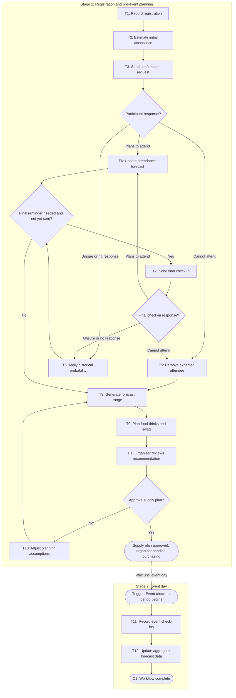

# Workflow of Tasks

## 1. Workflow Overview
### 1.1 Workflow Goal
This workflow supports the system goal defined in `my_first_agent/README.md`.

### 1.2 Workflow Trigger

This workflow runs in two stages, each with its own trigger:

- Stage 1 (Registration and pre-event planning): A participant registers prior to the CPVC event.
- Stage 2 (Event day): The CPVC event check-in period begins.

### 1.3 Completion Condition at Runtime

The participant’s attendance status is recorded at event check-in, and the forecast is compared with actual attendance for future improvement.

### 1.4 General Workflow

When a participant registers, HackTrack stores only the registration information necessary for attendance planning, such as registration date, event type, and an optional attendance-confidence response. It does not collect unrelated personal data or infer sensitive characteristics. The system begins with CPVC’s historical attendance rate and adjusts the event forecast as participants voluntarily confirm, decline, or indicate that they are unsure.

HackTrack sends at most two concise reminders: one confirmation request several days before the event and, if necessary, one final check-in shortly before the event. Participants can opt out of reminders. If a final check-in is sent, the participant's response to it (attending, not attending, or no response) is captured and updates the forecast in the same way as the first response, and no further reminders are sent. The system combines aggregate responses with historical attendance patterns to produce a forecast range and uncertainty level. It then uses that range to generate a recommended supply plan for food, drinks, and swag. An organizer reviews the forecast and supply recommendation together and either approves the plan or asks for the planning assumptions to be adjusted. The organizer handles purchasing after approval.

Once the plan is approved, the workflow pauses until event day. When the event check-in period begins, actual check-ins are recorded in aggregate and used to improve future forecasts.

### 1.5 Workflow Diagram

```mermaid
flowchart TD
    subgraph S1["Stage 1: Registration and pre-event planning"]
        T1["T1: Record registration"] --> T2["T2: Estimate initial attendance"]
        T2 --> T3["T3: Send confirmation request"]
        T3 --> D1{"Participant response?"}

        D1 -->|Plans to attend| T4["T4: Update attendance forecast"]
        D1 -->|Cannot attend| T5["T5: Remove expected attendee"]
        D1 -->|Unsure or no response| T6["T6: Apply historical probability"]

        T4 --> D2{"Final reminder needed and not yet sent?"}
        T6 --> D2
        T5 --> T8["T8: Generate forecast range"]

        D2 -->|Yes| T7["T7: Send final check-in"]
        D2 -->|No| T8

        T7 --> D4{"Final check-in response?"}
        D4 -->|Plans to attend| T4
        D4 -->|Cannot attend| T5
        D4 -->|Unsure or no response| T6

        T8 --> T9["T9: Plan food drinks and swag"]
        T9 --> H1["H1: Organizer reviews recommendation"]
        H1 --> D3{"Approve supply plan?"}
        D3 -->|No| T10["T10: Adjust planning assumptions"]
        T10 --> T8
        D3 -->|Yes| P1(["Supply plan approved; organizer handles purchasing"])
    end

    subgraph S2["Stage 2: Event day"]
        E1(["Trigger: Event check-in period begins"]) --> T11["T11: Record event check-ins"]
       T11 --> T12["T12: Update aggregate forecast data"]
        T12 --> C1(["C1: Workflow complete"])
    end

    P1 -.->|Wait until event day| E1
```
